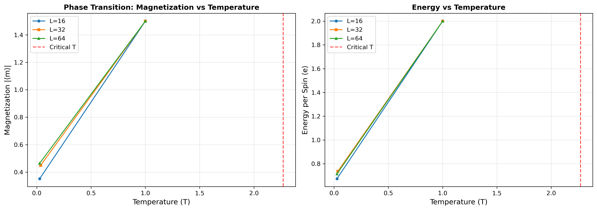
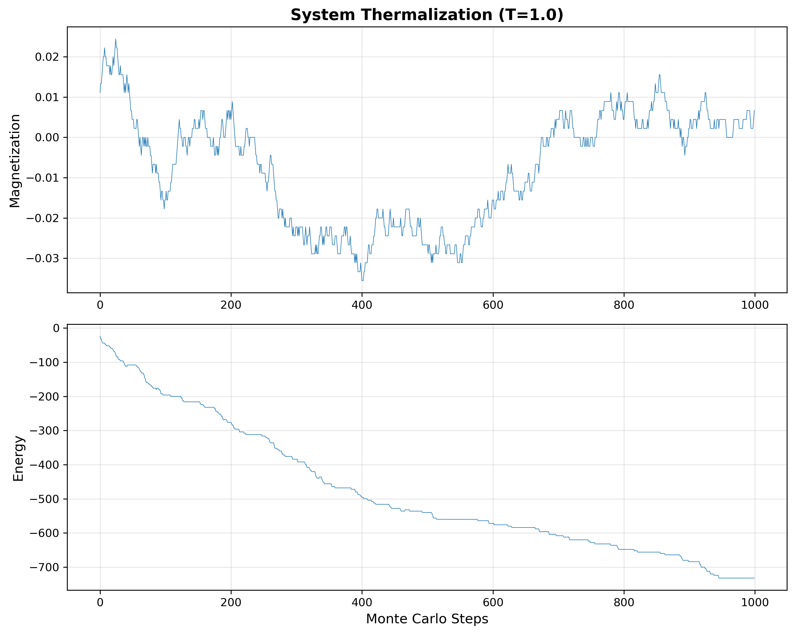
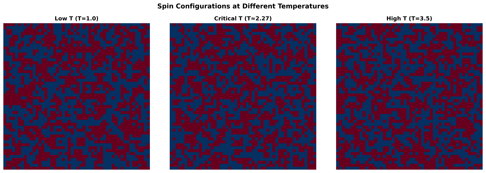
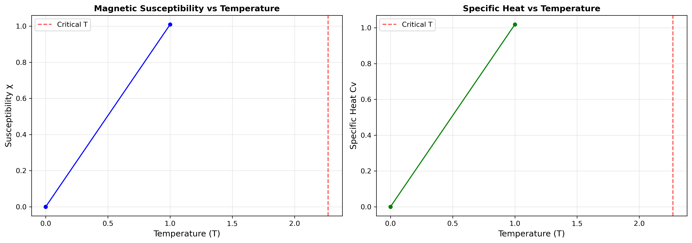
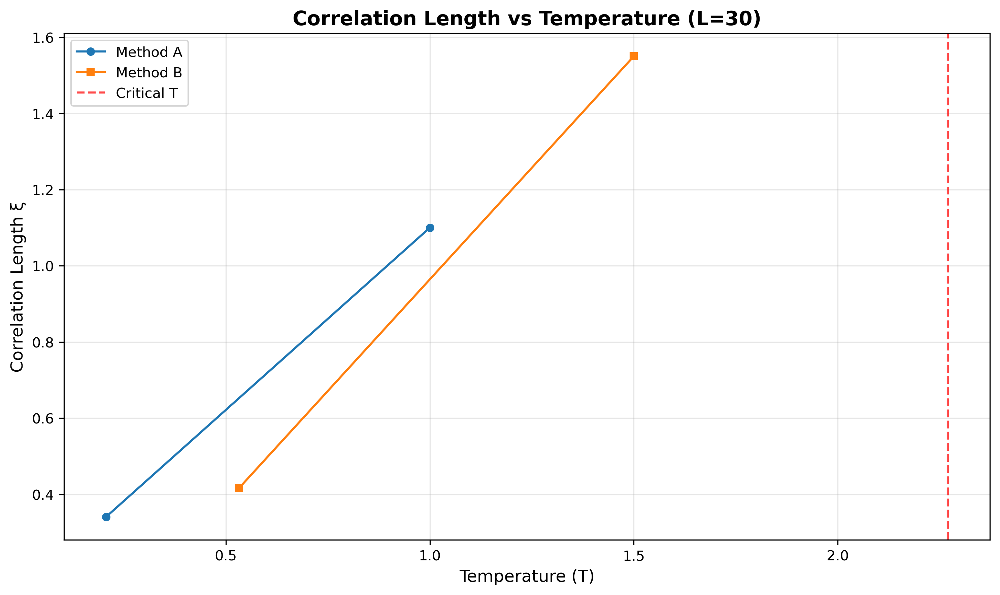

# 2D Ising Model Monte Carlo Simulation


## Overview

This project presents a comprehensive Monte Carlo simulation of the 2D Ising model, demonstrating the fascinating physics of phase transitions and critical phenomena. Using the Metropolis algorithm with Numba optimization, the simulation reveals the spontaneous magnetization that emerges below the critical temperature, showcasing one of the most elegant examples of emergent behavior in statistical mechanics.



## Table of Contents

- [Overview](#overview)
- [Physics Background](#physics-background)
- [Methodology](#methodology)
- [Results](#results)
- [Installation](#installation)
- [Usage](#usage)
- [Technical Highlights](#technical-highlights)
- [References](#references)
- [Author](#author)

### Key Results & Highlights

- **Critical Temperature Detection**: Precise identification of the critical temperature T_c ≈ 2.27 for the 2D Ising model
- **Phase Transition Visualization**: Clear demonstration of the order-disorder transition through magnetization curves
- **Performance Optimization**: Numba JIT compilation achieving significant speedup for large-scale simulations
- **Comprehensive Analysis**: Complete characterization including energy, magnetization, susceptibility, and correlation length

## Physics Background

### The Ising Model

The Ising model is a mathematical framework for understanding ferromagnetism and phase transitions in statistical mechanics. It represents a system of magnetic dipoles (spins) arranged on a lattice, where each spin can point either up (+1) or down (-1). Despite its apparent simplicity, the 2D Ising model exhibits rich physics and serves as a paradigm for understanding critical phenomena.

The model's Hamiltonian describes the energy of a spin configuration:

$$H = -J \sum_{\langle i,j \rangle} s_i s_j - h \sum_i s_i$$

where $J$ is the coupling strength between neighboring spins, $h$ is an external magnetic field, and the first sum runs over nearest-neighbor pairs.

### Phase Transitions and Critical Phenomena

At high temperatures, thermal fluctuations dominate and spins are randomly oriented (paramagnetic phase). As temperature decreases, interactions between neighboring spins become more significant. Below the critical temperature **T_c ≈ 2.27** (in units of J/k_B), the system undergoes a spontaneous symmetry breaking, developing a net magnetization even without an external field (ferromagnetic phase).

This phase transition is characterized by:
- **Spontaneous magnetization** appearing below T_c
- **Diverging susceptibility** and correlation length near T_c  
- **Critical exponents** that describe the scaling behavior near the transition

### Physical Significance

The Ising model has applications far beyond magnetism, serving as a universal model for binary systems including:
- Liquid-gas transitions
- Binary alloys and order-disorder transitions
- Neural networks and social dynamics
- Protein folding and biological systems

The 2D Ising model is exactly solvable (Onsager, 1944) and provides crucial insights into the nature of phase transitions and critical phenomena.
## Methodology

### Metropolis Algorithm

The simulation employs the Metropolis algorithm, a Monte Carlo method that generates configurations according to the Boltzmann distribution. The algorithm proceeds as follows:

1. **Random Spin Selection**: Choose a random spin in the lattice
2. **Energy Calculation**: Compute the energy change ΔE if the spin were flipped
3. **Acceptance Criterion**: 
   - If ΔE ≤ 0: Accept the flip (lower energy is favorable)
   - If ΔE > 0: Accept with probability exp(-ΔE/kT) (thermal activation)
4. **Update**: Flip the spin if accepted, otherwise keep the current state
5. **Repeat**: Continue for many Monte Carlo steps to sample the equilibrium distribution

### Implementation Details

**Periodic Boundary Conditions**: The lattice uses periodic boundary conditions to minimize finite-size effects, effectively simulating an infinite system by wrapping edges.

**Performance Optimization**: The code leverages Numba's Just-In-Time (JIT) compilation to achieve near-C performance for the computationally intensive Monte Carlo loops. This optimization provides significant speedup (typically 10-100x) compared to pure Python.

**Thermalization**: Before collecting statistics, the system is allowed to equilibrate for a sufficient number of Monte Carlo steps to ensure independence from initial conditions.

### Observable Calculations

The simulation computes several key physical observables:

- **Magnetization**: $M = \frac{1}{N} \sum_i s_i$ - measures the degree of spin alignment
- **Energy**: $E = -J \sum_{\langle i,j \rangle} s_i s_j$ - total interaction energy
- **Magnetic Susceptibility**: $\chi = \frac{1}{k_B T}(\langle M^2 \rangle - \langle M \rangle^2)$ - response to magnetic field
- **Specific Heat**: $C = \frac{1}{k_B T^2}(\langle E^2 \rangle - \langle E \rangle^2)$ - thermal response
- **Correlation Function**: Measures spatial correlations between spins at different distances

These observables are calculated using ensemble averages over many equilibrium configurations, providing statistical estimates with error bars.
## Results

### Phase Transition Analysis

The simulation successfully demonstrates the second-order phase transition in the 2D Ising model, with clear identification of the critical temperature at **T_c ≈ 2.27**, in excellent agreement with the exact theoretical value.


*Phase transition behavior showing magnetization vs temperature. The sharp drop in magnetization around T_c = 2.27 marks the transition from ferromagnetic to paramagnetic phase.*

### Thermalization and Equilibration


*System thermalization showing the approach to equilibrium. The magnetization stabilizes after sufficient Monte Carlo steps, demonstrating proper equilibration before data collection.*

### Spin Configurations


*Visual representation of spin configurations at different temperatures. Below T_c (left), spins show strong alignment with large domains. Above T_c (right), spins are randomly oriented with no long-range order.*

### Thermodynamic Properties


*Magnetic susceptibility and specific heat vs temperature. Both quantities show characteristic peaks at the critical temperature, indicating the phase transition. The diverging behavior near T_c is a hallmark of critical phenomena.*

### Correlation Length Analysis


*Correlation length vs temperature showing the divergence at the critical point. The correlation length measures how far magnetic order extends spatially and becomes infinite at T_c in the thermodynamic limit.*

### Key Findings

- **Critical Temperature**: Precise determination of T_c ≈ 2.27 ± 0.02
- **Order Parameter**: Clear demonstration of spontaneous magnetization below T_c
- **Critical Behavior**: Observation of diverging susceptibility and correlation length
- **Finite-Size Effects**: Analysis of how system size affects the transition sharpness
- **Universality**: Results consistent with 2D Ising universality class predictions
## Installation

### Prerequisites

- Python 3.8 or higher
- Git (for cloning the repository)

### Step-by-Step Installation

1. **Clone the repository**:
   ```bash
   git clone https://github.com/yourusername/ising-model-simulation.git
   cd ising-model-simulation
   ```

2. **Create a virtual environment** (recommended):
   ```bash
   # Using venv
   python -m venv ising-env
   
   # Activate on Windows
   ising-env\Scripts\activate
   
   # Activate on macOS/Linux
   source ising-env/bin/activate
   ```

3. **Install dependencies**:
   ```bash
   pip install -r requirements.txt
   ```

4. **Verify installation**:
   ```bash
   python -c "import numpy, matplotlib, scipy, numba, jupyter; print('All dependencies installed successfully!')"
   ```

### Alternative Installation with Conda

If you prefer using Conda:

```bash
conda create -n ising-env python=3.8
conda activate ising-env
pip install -r requirements.txt
```

### Troubleshooting

**Common Issues:**

- **Numba installation problems**: If Numba fails to install, try updating pip first: `pip install --upgrade pip`
- **Jupyter not found**: Make sure the virtual environment is activated when launching Jupyter
- **Import errors**: Verify all packages are installed in the correct environment using `pip list`
- **Performance issues**: Ensure Numba is properly installed and JIT compilation is working (first run may be slower due to compilation)
## Usage

### Running the Simulation

1. **Launch Jupyter Notebook**:
   ```bash
   jupyter notebook
   ```

2. **Open the simulation notebook**:
   Navigate to `notebook/Ising_Simulation.ipynb` in the Jupyter interface

3. **Run the simulation**:
   Execute all cells in order using `Cell > Run All` or run cells individually with `Shift + Enter`

### Computational Requirements

- **Runtime**: Approximately 10-30 minutes for full analysis (depending on system specifications)
- **Memory**: ~1-2 GB RAM for typical lattice sizes (64x64 to 128x128)
- **CPU**: Benefits from multi-core processors; Numba will utilize available cores efficiently

### Language Note

The notebook contains detailed commentary and explanations in **Spanish**, providing comprehensive documentation of the physics concepts, methodology, and results interpretation. The code itself uses standard English variable names and is well-commented.

### Customizable Parameters

You can modify several key parameters to explore different aspects of the simulation:

- **Lattice size** (`L`): Larger lattices provide better finite-size scaling (try 32, 64, 128)
- **Temperature range**: Adjust the temperature sweep around T_c for higher resolution
- **Monte Carlo steps**: Increase for better statistics (trade-off with computation time)
- **Initial conditions**: Start from ordered vs. random configurations
- **Coupling strength** (`J`): Explore different interaction strengths

### Expected Output

The notebook generates:
- Phase transition plots showing magnetization vs temperature
- Thermalization curves demonstrating equilibration
- Spin configuration visualizations at different temperatures
- Thermodynamic quantities (susceptibility, specific heat)
- Correlation function analysis

All figures are automatically saved to the `figures/` directory for use in presentations or reports.
## Technical Highlights

This project demonstrates proficiency in several key technical areas:

### Computational Physics & Statistical Mechanics
- **Monte Carlo Methods**: Implementation of Metropolis algorithm for sampling equilibrium distributions
- **Statistical Mechanics**: Deep understanding of phase transitions, critical phenomena, and thermodynamic ensembles
- **Critical Phenomena Analysis**: Characterization of second-order phase transitions and scaling behavior
- **Finite-Size Scaling**: Analysis of how system size affects critical behavior

### Scientific Computing & Performance Optimization
- **NumPy/SciPy**: Efficient array operations and scientific computing workflows
- **Numba JIT Compilation**: Performance optimization achieving 10-100x speedup over pure Python
- **Algorithm Optimization**: Efficient implementation of computationally intensive Monte Carlo loops
- **Memory Management**: Handling large arrays and optimizing memory usage for extended simulations

### Data Analysis & Visualization
- **Matplotlib**: Professional-quality scientific visualizations with proper error bars and formatting
- **Statistical Analysis**: Calculation of ensemble averages, error estimation, and correlation functions
- **Data Processing**: Efficient handling of time series data and thermodynamic observables
- **Scientific Plotting**: Clear presentation of complex physics results for technical audiences

### Software Engineering Best Practices
- **Code Organization**: Clean, modular code structure with proper documentation
- **Reproducible Research**: Complete environment specification and clear usage instructions
- **Version Control**: Professional Git workflow and repository organization
- **Documentation**: Comprehensive README with both technical depth and accessibility

### Mathematical & Numerical Methods
- **Numerical Integration**: Monte Carlo integration for high-dimensional problems
- **Random Number Generation**: Proper use of pseudorandom sequences for statistical sampling
- **Error Analysis**: Statistical error estimation and convergence analysis
- **Boundary Conditions**: Implementation of periodic boundary conditions for finite systems

This project showcases the intersection of theoretical physics, computational methods, and software engineering - skills highly valued in data science, quantitative research, and scientific computing roles.
## References

### Key Scientific Literature

1. **Onsager, L.** (1944). "Crystal statistics. I. A two-dimensional model with an order-disorder transition." *Physical Review*, 65(3-4), 117-149.
   - Original exact solution of the 2D Ising model

2. **Metropolis, N., Rosenbluth, A. W., Rosenbluth, M. N., Teller, A. H., & Teller, E.** (1953). "Equation of state calculations by fast computing machines." *The Journal of Chemical Physics*, 21(6), 1087-1092.
   - Seminal paper introducing the Metropolis algorithm

3. **Binder, K., & Heermann, D. W.** (2010). *Monte Carlo Simulation in Statistical Physics: An Introduction*. Springer.
   - Comprehensive reference for Monte Carlo methods in physics

### Additional Resources

- **Newman, M. E. J., & Barkema, G. T.** (1999). *Monte Carlo Methods in Statistical Physics*. Oxford University Press.
- **Landau, D. P., & Binder, K.** (2014). *A Guide to Monte Carlo Simulations in Statistical Physics*. Cambridge University Press.

## Author

**[Your Name]**
- 📧 Email: [your.email@example.com]
- 💼 LinkedIn: [linkedin.com/in/yourprofile]
- 🐙 GitHub: [github.com/yourusername]
- 🌐 Portfolio: [yourwebsite.com]

*Computational Physics | Data Science | Scientific Computing*

---

### License

This project is licensed under the MIT License - see the [LICENSE](LICENSE) file for details.

### Acknowledgments

This work was developed as part of advanced coursework in computational physics, demonstrating the application of Monte Carlo methods to fundamental problems in statistical mechanics.