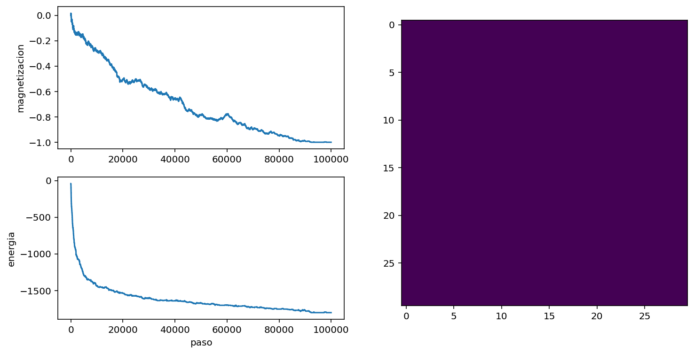
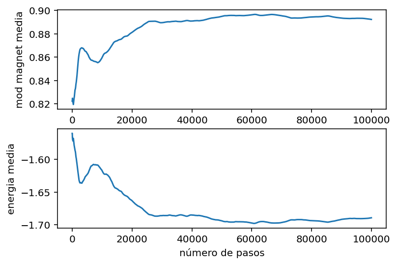
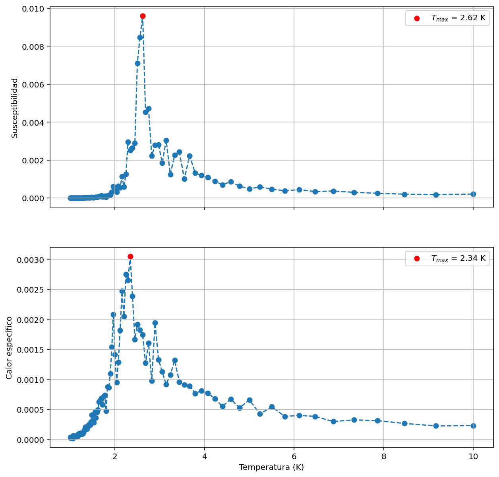
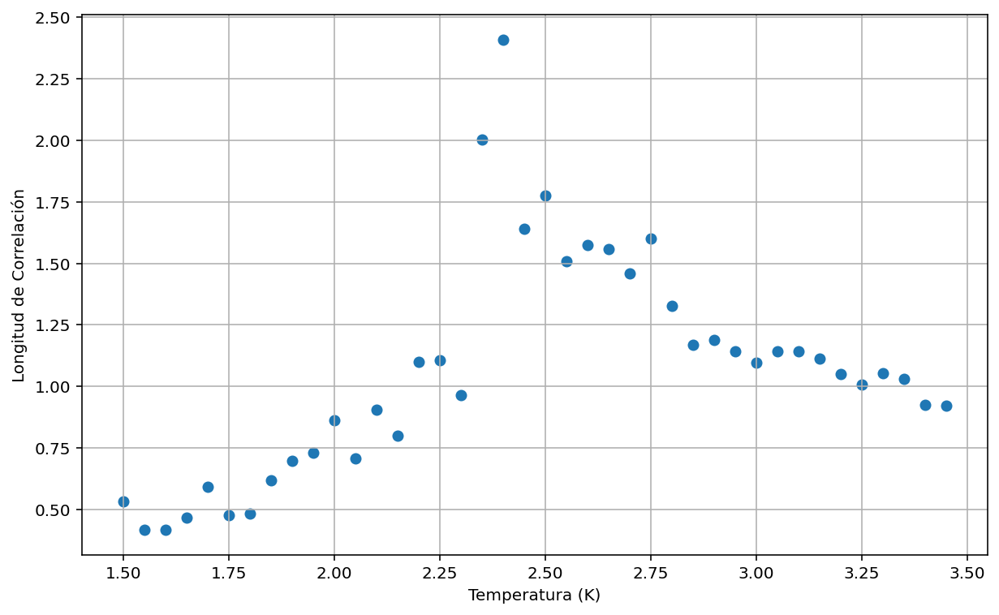
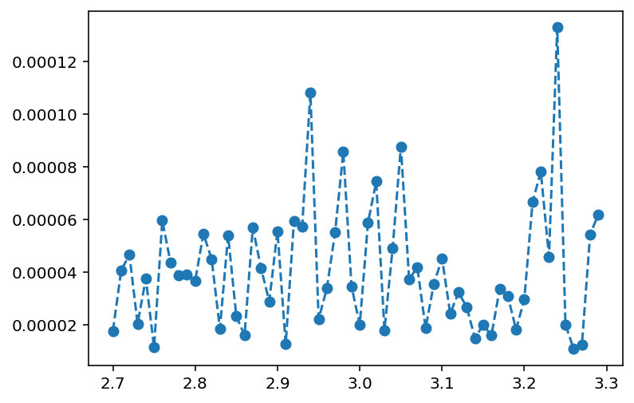
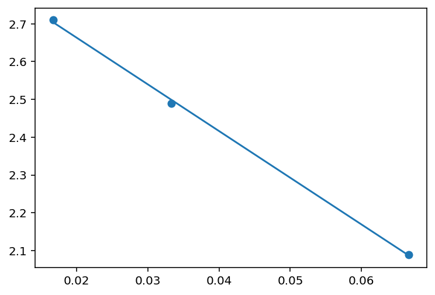

## Resumen del Proyecto

Este proyecto implementa una simulación Monte Carlo del modelo de Ising en 2D para estudiar la transición de fase ferromagnética que ocurre cerca de la temperatura crítica T ≈ 2.27 K. La simulación utiliza el algoritmo de Metropolis para generar configuraciones de equilibrio térmico y calcular observables termodinámicos como magnetización, energía, susceptibilidad magnética y calor específico.


## Fundamentos Físicos

### El Modelo de Ising

El modelo de Ising es uno de los modelos más importantes en mecánica estadística para describir el ferromagnetismo. Consiste en una red de espines que pueden tomar valores +1 o -1, con interacciones únicamente entre primeros vecinos.

La energía del sistema está dada por el Hamiltoniano:

```
H = -J ∑⟨i,j⟩ σᵢσⱼ
```

donde J es la constante de acoplamiento, σᵢ representa el espín en el sitio i, y la suma se realiza sobre todos los pares de primeros vecinos.

### Transición de Fase

A temperatura finita, el sistema experimenta una transición de fase de segundo orden en T_c ≈ 2.269 K (solución exacta de Onsager). Por debajo de esta temperatura, el sistema presenta orden magnético espontáneo, mientras que por encima se encuentra en fase paramagnética.

### Fenómenos Críticos

Cerca de la temperatura crítica, las propiedades del sistema exhiben comportamiento crítico caracterizado por:
- Divergencia de la susceptibilidad magnética
- Divergencia del calor específico  
- Divergencia de la longitud de correlación
- Fluctuaciones críticas de gran amplitud

## Metodología

### Algoritmo de Metropolis

La simulación utiliza el algoritmo de Metropolis para generar configuraciones de equilibrio:

1. **Selección aleatoria**: Se elige un espín al azar en la red
2. **Cálculo de energía**: Se calcula el cambio de energía ΔE al invertir el espín
3. **Criterio de aceptación**: 
   - Si ΔE ≤ 0: se acepta el cambio
   - Si ΔE > 0: se acepta con probabilidad exp(-βΔE)

### Condiciones de Contorno

Se implementan condiciones de contorno periódicas para minimizar efectos de borde y simular un sistema infinito.

### Optimización Computacional

- **Numba JIT**: Compilación just-in-time para acelerar las funciones críticas
- **Cálculo eficiente de ΔE**: Solo considera los 4 primeros vecinos del espín seleccionado
- **Termalización adaptativa**: Número de pasos ajustado según la temperatura

## Resultados

### 1. Proceso de Termalización

Partiendo de un cierto estado inicial, se estudia cuántos pasos son necesarios para que el sistema llegue al equilibrio. Para eso, graficamos la magnetización y la energía por partícula en función del paso; el equilibrio se alcanza cuando estas cantidades empiezan a fluctuar alrededor de un valor fijo, en lugar de ser netamente crecientes o decrecientes. El número de pasos necesarios para alcanzar el equilibrio dependerá de la temperatura. Se utilizó una red de 30x30 y un β=1.



El sistema alcanza el equilibrio térmico después de ~10⁶ pasos Monte Carlo, como se observa en la estabilización de la magnetización y energía. A la derecha se muestra el estado final, donde se puede ver que todos los espines apuntan en una misma dirección.


Si, por otro lado, se usa una temperatura mayor a la temperatura crítica (β=10), se puede ver un comportamiento muy distinto, donde la agitación termica le gana a la fuerza que alinea los espines

Ahora no hay magnetización media apreciable y los espines apuntan en direcciones aleatorias.

### 2. Transición de Fase



La magnetización muestra una transición suave pero pronunciada cerca de T_c, característica de una transición de fase de segundo orden en sistemas finitos.

### 3. Observables Termodinámicos
Se analizó el valor de la suceptibilidad magnética y el calor específico en función de la temperatura. En teoría, ambas magnitudes deberían experimentar un pico en la temperatura crítica. Estos resultados predicen temperaturas críticas a 2.62 y 2.34 respectivamente.


### 4. Susceptibilidad y Calor Específico

Ambas cantidades muestran picos pronunciados en T_c, indicando la presencia de fluctuaciones críticas. Los máximos permiten estimar la temperatura crítica.

### 5. Configuraciones de Espines



Visualización de las configuraciones típicas a diferentes temperaturas, mostrando la transición del orden magnético al desorden térmico.

### 6. Longitud de Correlación



La función de correlación g(r) = ⟨σᵢσⱼ⟩ - ⟨σᵢ⟩⟨σⱼ⟩ sigue un decaimiento exponencial g(r) ∝ exp(-r/ξ), donde ξ es la longitud de correlación. Cuando se analiza el valor de este ξ se encuentra un pico en la temperatura 2.40 simbolizando criticalidad.

### 7. Longitud de Correlación



La longitud de correlación diverge al aproximarse a la temperatura crítica, comportamiento característico de las transiciones de fase continuas.

## Resultados Principales

### Estimaciones de Temperatura Crítica

| Método | T_c (K) | Error vs Onsager |
|--------|---------|------------------|
| Susceptibilidad (L=30) | 2.62 | +0.35 |
| Calor Específico (L=30) | 2.34 | +0.07 |
| Longitud de Correlación | 2.40 | +0.13 |
| Finite-Size Scaling | 2.91 | +0.64 |
| **Onsager (exacto)** | **2.269** | **0.00** |

### Análisis de Finite-Size Scaling

Utilizando la relación T_c(L) = T_c + a/L para diferentes tamaños de red (L = 15, 30, 60, 120), se extrapoló la temperatura crítica del límite termodinámico.

## Instalación y Uso

### Prerrequisitos

- Python 3.8 o superior
- Git (para clonar el repositorio)

### Instalación

```bash
# Clonar el repositorio
git clone https://github.com/ItzWhole/ising-model-simulation.git
cd ising-model-simulation

# Crear entorno virtual (recomendado)
python -m venv venv

# Activar entorno virtual
# En Windows:
venv\Scripts\activate
# En macOS/Linux:
source venv/bin/activate

# Instalar dependencias
pip install -r requirements.txt
```

### Ejecución

```bash
# Lanzar Jupyter Notebook
jupyter notebook

# Abrir el notebook principal
# Navegar a: notebook/Ising_Simulation.ipynb
```

### Parámetros Configurables

El notebook permite modificar fácilmente:
- **L**: Tamaño de la red (por defecto: 30×30)
- **nequilibrio**: Pasos de termalización (por defecto: 10⁷)
- **npromedio**: Pasos para promedios (por defecto: 10⁵)
- **Rango de temperaturas**: Para análisis de transición de fase

### Requisitos Computacionales

- **Memoria RAM**: ~2 GB para redes 30×30
- **Tiempo de ejecución**: 
  - Termalización: ~30 minutos por temperatura
  - Análisis completo: 2-4 horas
- **Almacenamiento**: ~50 MB para resultados y figuras

## Aspectos Técnicos Destacados

### Habilidades Computacionales

- **Métodos Monte Carlo**: Implementación del algoritmo de Metropolis
- **Mecánica Estadística**: Cálculo de observables termodinámicos
- **Optimización Numérica**: Uso de Numba para compilación JIT
- **Análisis de Datos**: Procesamiento estadístico de series temporales
- **Visualización Científica**: Matplotlib para gráficos profesionales

### Técnicas Avanzadas

- **Finite-Size Scaling**: Extrapolación al límite termodinámico
- **Análisis de Correlaciones**: Cálculo de funciones de correlación espacial
- **Ajuste de Curvas**: Determinación de parámetros críticos
- **Control de Errores**: Análisis estadístico de incertidumbres

### Optimizaciones de Rendimiento

- **Compilación JIT**: Aceleración 50-100× con Numba
- **Algoritmos Eficientes**: Cálculo local de cambios de energía
- **Gestión de Memoria**: Uso eficiente de arrays NumPy
- **Paralelización**: Preparado para extensión a múltiples cores

## Referencias

### Literatura Científica

1. **Onsager, L.** (1944). "Crystal statistics. I. A two-dimensional model with an order-disorder transition." *Physical Review*, 65(3-4), 117-149.

2. **Metropolis, N., et al.** (1953). "Equation of state calculations by fast computing machines." *Journal of Chemical Physics*, 21(6), 1087-1092.

3. **Fisher, M. E., & Barber, M. N.** (1972). "Scaling theory for finite-size effects in the critical region." *Physical Review Letters*, 28(23), 1516-1519.
